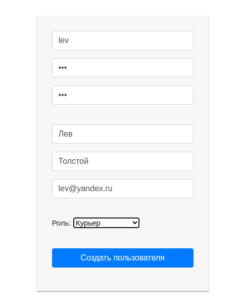

# 2. Архитектурные стили 
## Задача
Что нужно сделать
Для запуска приложения можете использовать скомпилированный файл JAR. 
Для этого [скачайте архив](files/monolithic-app-1.0.0.zip), распакуйте его и 
в терминале, находясь в папке с JAR-файлом, выполните код:
java -Dfile.encoding=UTF-8 -jar monolithic-app-1.0.0.jar

По порядку ответьте на следующие вопросы:
- В каком архитектурном стиле выполнено приложение?
- На каком порту запускается приложение?
- Какой cookie-файл (укажите название) выписывается клиенту при удачной аутентификации?
- Сколько позиций «Диван» доступно для продажи на старте приложения?
- Какой HTTP status code возвращается при попытке зарегистрировать уже существующего пользователя?

Для лучшего понимания работы приложения попробуйте выполнить несколько сценариев работы пользователя с ним:
- Создайте нового пользователя с ролью «Курьер».
- Закажите и оплатите в магазине три товара. Для этого добавьте товары в корзину и нажмите на кнопку «Оплата».
- Добавьте на склад новый товар «Шкаф» стоимостью 10 тыс. руб.

---
## Решение

Приложение выполнено в стиле монолит.

Приложение запускается на порту 8080.

Выписывается следующий cookie: remember-me

Диванов доступно 7.

При попытке зарегистрировать уже существующего пользователя возвращается код 409.

Пользователь с ролью "Курьер" создан:

Товар заказан и оплачен:

Товар добавлен

