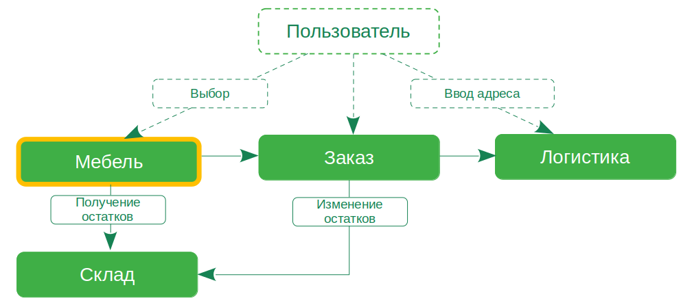

## Задание

Что нужно сделать

Основываясь на описании владельца из домашнего задания к уроку 2:

Выделите домены нашей системы, их будет четыре при текущем уровне декомпозиции.
Выделите Core Domain (смысловое ядро).
Выберите и опишите тип связи между доменами из тех, что были на уроке. Объясните логику выбора.
Распишите агрегат для кухонного гарнитура и его составляющие (укажите примеры объектов значений, сущностей и бизнес-логики).

Будет не так просто, так как у вас нет возможности поговорить с доменными экспертами, но вспомните, что мы на уроке уже выделяли домены, но там не хватало одного — Core Domain. 

## Решение

### Домены в системе:

1. **Мебель (товары на сайте)**:
   - Этот домен отвечает за представление доступной мебели на сайте компании. 
   - Взаимодействует с доменами "Заказ" и "Склад".
   - При оформлении заказа "Пользователь" видит доступные товары, именно они становятся объектом заказа.
   - Кол-во доступного для заказа товара получает из домена "Склад".

2. **Заказ**:
   - Этот домен отвечает за процесс заказа мебели через сайт.
   - Взаимодействует с доменами "Мебель", "Логистика" - тип связи "зависимость". 
   - Из "Мебели" состоит заказ, "Логистика" осуществляется для "Заказа".
   - С доменом "Склад" взаимодействует для резервирования или изменения остатков.
   - После выбора клиентом товара, происходит оформление заказа, он резервируется на складе и передается в логистику 
для доставки.

3. **Склад**:
   - Этот домен управляет доступностью товаров на складе.
   - Взаимодействует с доменами "Мебель" и "Заказ".
   - При поступлении заказа, склад подтверждает наличие товара для резервации и последующей передачи в логистику.

4. **Логистика**:
   - Этот домен отвечает за организацию доставки заказанных товаров клиентам.
   - Взаимодействует с доменами "Заказ" и "Склад".
   - Получая информацию о заказе, логистика готовит маршрут и осуществляет доставку в установленное время.

5. **Пользователь**
   - Субдомен для авторизации пользователя, осуществления взаимодействия с сайтом.
   - В дальнейшем может использоваться для осуществления маркетинговых коммуникаций с клиентом.

**Core Domain**: Мебель - именно продажа мебели приносит прибыль бизнесу.

### Агрегат для кухонного гарнитура:
Объекты значений: Название гарнитура, цена, описание.
Сущности: Кухонные элементы, материалы, цвета.
Бизнес-логика: Сборка гарнитура, учет доступности элементов, ценообразование.